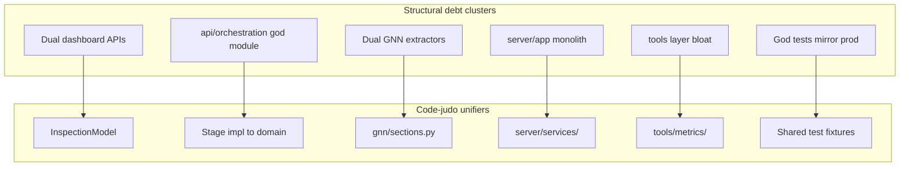

# Thermo-Nuclear Code Quality Review — COGANT (`working/cogant`)

**Date:** 2026-06-02  
**Scope:** Full first-party codebase (clean `main`, no PR diff)  
**Rubric:** `thermo-nuclear-code-quality-review` (cursor-team-kit skill)  
**Exclusions:** `.venv/`, `cogant/output/` (generated clones), `evaluation/eval_repos/*` (vendored benchmarks)

---

## 0. Reconciliation — 2026-06-09 (verifier-first re-audit at current HEAD)

This review is now **partially out-of-sync**. A verifier-first RedTeam re-audit
(2026-06-09) checked every presumptive blocker against current HEAD with a
grep/wc oracle. Status below is the ground truth; the body sections that follow
describe the **2026-06-02** state and are retained for history.

| Item | 2026-06-02 | 2026-06-09 verdict | Evidence |
|------|-----------|--------------------|----------|
| **B6** `run_batch(args)` re-parses argv | Blocker | ✅ **FIXED** | `run_all_runner.py:507` → `def run_batch(options: RunBatchOptions \| argparse.Namespace)` |
| **B7** `FALLBACK_METRICS` shadow copy | Blocker | ✅ **FIXED** | `grep FALLBACK_METRICS tools/audit_manuscript_numbers.py` → 0 hits |
| **Code-judo #5** rule-registry factory | High | ✅ **FIXED** | `translate/default_engine.py:11-18` registry factory; import wall removed from `orchestration.py` |
| **B2** dead `_generate_mermaid_tab` | Blocker | ✅ **FIXED 2026-06-09** | removed `viz/dashboard/generator.py` (never referenced in tab nav) |
| **High-137** dead `_rule_dependency_graph` | High | ✅ **FIXED 2026-06-09** | removed write-only dead state in `translate/engine.py` |
| **Low-147** dead ternary expression | Low | ✅ **FIXED 2026-06-09** | removed discarded `width/len(kinds)` expr `generator.py:298` |
| **B1** 11 production modules >1k lines | Blocker | ⛔ **OPEN** | `inspection_dashboard.py` 2530, `compiler.py` 1447, `orchestration.py` 1380, … |
| **B3** `api/orchestration.py` god module | Blocker | 🟡 **PARTIAL** | 1380 lines (was 1440); still owns stage bodies + graph build |
| **B4** duplicate GNN sidecar files | Blocker | ⛔ **OPEN** | `actions.json` ≡ `actions_policies.json` still both emitted |
| **B5** `server/app.py` inline rule catalog | Blocker | 🟡 **PARTIAL** | rules still hardcoded `app.py:761-933` |
| **B8** 3240-line `orchestrate_roundtrip.py` | Blocker | 🟡 **PARTIAL** | still 3240 lines |

**Net:** the three P0 quick wins (B6, B7, registry factory) and three dead-code
items are done; the **structural decomposition of the >1k-line god modules
(B1/B3/B4/B5/B8) remains OPEN** and is tracked, not regressed. It was
deliberately NOT executed in the 2026-06-09 pass because a blind decompose is
high-risk against a 9691-test suite and an active maintenance loop; it needs its
own scoped, single-monolith-at-a-time sprint per §11.

---

## 1. Executive verdict: **BLOCK**

COGANT is functionally rich, well-tested, and release-disciplined (METRICS.yaml, audit gates, manuscript pipeline). **Maintainability does not pass the thermo-nuclear bar.** The codebase has accumulated **15 first-party files above 1,000 lines** (11 in `py/cogant/`, 4 in `tools/`), **three parallel dashboard HTML stacks**, **two parallel GNN export implementations**, **graph construction living in `api/` instead of `graph/`**, and **92 coverage-targeted test files** (17 over 1k lines) that mirror production sprawl.

Behavior may be correct; structure must be refactored before the next feature wave.

---

## 2. Baseline metrics

| Metric | Value |
|--------|------:|
| `py/cogant/` Python modules | ~231 |
| `py/cogant/` total LOC | ~82,121 |
| `viz/` subsystem LOC | ~19,469 (~24% of package) |
| Production files >1k lines | 11 |
| Tools files >1k lines | 4 |
| Test files >1k lines | 17 (of 92 `*targeted*` files) |
| Largest production file | `viz/inspection_dashboard.py` (2,530) |
| Largest test file | `test_server_statespace_compiler.py` (1,800) |
| Largest example | `examples/orchestrate_roundtrip.py` (3,240) |

**Complexity hotspots (radon):**

| Function | Complexity | File |
|----------|:----------:|------|
| `build_rule_evidence_trace` | E (36) | `translate/evidence.py:235` |
| `verify_repo_roundtrip` | E (34) | `reverse/idempotency.py:1151` |
| `StateSpaceCompiler._extract_action_effects` | D (30) | `statespace/compiler.py:1133` |
| `verify_roundtrip` | D (29) | `reverse/idempotency.py:954` |

**Import fan-in:** `viz/inspection_dashboard` referenced from 10 files (orchestrator, export, pyi stubs). `api/orchestration` imported from `api/pipeline`, `api/session`, `server/app`, `gnn/package`.

---

## 3. Presumptive blockers

| # | Blocker | Evidence |
|---|---------|----------|
| B1 | **11 production modules >1k lines** without decomposition | See §6 per-file verdicts |
| B2 | **Dual dashboard architecture** (artifact-first + in-memory) with no shared model | `inspection_dashboard.py:3-8` vs `dashboard/generator.py:26-80`; production uses inspection path only (`viz/png/orchestrator.py:251-263`) |
| B3 | **`api/orchestration.py` (1,440 lines)** owns stage implementations, graph construction, rule registration, and in-memory translation | `run_graph` 448–681, `_default_translation_engine` 176–211 |
| B4 | **GNN export sprawl** — parallel extractors in `gnn/package.py` and `gnn/json_export.py` with duplicate sidecar files | `actions.json` ≡ `actions_policies.json`; `preferences.json` ≡ `preferences_constraints.json` |
| B5 | **`server/app.py` (1,208 lines)** — route monolith with inline rule catalog and pipeline logic | Rules hardcoded 761–933; dual `/analyze` and `/api/v1/analyze` |
| B6 | **Thin-orchestrator contract violated** — `run_batch(args)` re-parses `sys.argv` | `tools/run_all_runner.py:486-499` |
| B7 | **METRICS single-source-of-truth violated** — `FALLBACK_METRICS` shadow copy | `tools/audit_manuscript_numbers.py:54-114` |
| B8 | **3,240-line "example"** reimplements full pipeline | `examples/orchestrate_roundtrip.py` |

---

## 4. Code-judo opportunities (top 10)

These reframes **delete whole layers** rather than rearrange them.

### 1. Single `InspectionModel`, two entry adapters (viz)

Introduce `viz/inspection/model.py` with a typed model tree. `build_inspection_model(run_dir)` remains canonical; add `build_inspection_model_from_objects(...)` for in-memory callers. **One HTML renderer** consumes the model. Retire or shrink `DashboardGenerator` to a layout adapter. Deletes ~1,300 lines of duplicated metrics cards, bar charts, and tables.

### 2. Explode `inspection_dashboard.py` along pipeline seams (2,530 → ~5 modules)

| Module | Owns |
|--------|------|
| `viz/inspection/loaders.py` | JSON coercion, path discovery (~550 lines) |
| `viz/inspection/model.py` | `build_inspection_model` |
| `viz/inspection/svg/` | Graphical abstract, detail PNGs, calibration charts |
| `viz/inspection/html/dashboard.py` | HTML layout, panels, CSS (extract inline CSS at 2171–2336) |
| `viz/inspection/write.py` | Public write/render API |

### 3. Shared viz primitives (`viz/_coerce.py`, `viz/_svg_bars.py`, `viz/_html_tables.py`)

Three implementations of "count by kind → SVG bar" exist in `inspection_dashboard.py`, `dashboard/generator.py`, and `plots.py`. One primitive deletes ~200 lines and three test matrices.

### 4. Move `run_graph` into `graph/from_repo.py`; thin `api/orchestration.py` to ~200 lines

Graph construction (~320 lines at 448–764) belongs in `graph/`, not `api/`. Stage runners move to `pipeline/stages/` or domain `*/stages.py`. In-memory translation moves to `api/translation.py`.

### 5. `translate.rules.default_engine()` — delete 22-line import wall

`translate/rules/__init__.py` already exports 22 classes in `__all__`. Replace manual `register_rule` calls in `orchestration.py:176-211` with a registry factory. New rules no longer require editing `api/`.

### 6. One GNN bundle, many JSON projections (`gnn/sections.py`)

`GNNJSONExporter.export()` produces the canonical 19-section dict. `GNNPackageBuilder` should **project** sidecar files from that dict, not re-extract 15+ times. Deletes ~400 lines and fixes policy-section inconsistency between exporters.

### 7. Split `reverse/idempotency.py` into `reverse/roundtrip/{ledger,compare,runner}.py`

Compare math ≠ pipeline runner ≠ datamodel. Target: no file >600 lines in roundtrip package. `RoundtripResult` becomes a `@dataclass` with `from_invariants()` factory.

### 8. `ActionEffectCollector` replaces `_extract_action_effects` strategies

Five sequential strategies (lines 1158–1221) → one directed walk from controller node emitting typed `Effect` records. Aligns with `_cross_reference_actions_and_variables` (638–687).

### 9. `server/services/` extraction — routes become 5-line adapters

Extract `analyze.py`, `roundtrip.py`, `visualize.py`, `rules.py` from `server/app.py`. Unify v0/v1 API via shared service + response wrapper. Target `app.py` ≤300 lines.

### 10. Fix orchestrator contract + table-driven batch steps

`RunBatchOptions` dataclass; `run_batch(options)` never re-parses argv. Split `run_all_runner.py` into `config.py`, `steps.py` (CommandSpec table), `runner.py`. Each <400 lines.

---

## 5. Findings table (merged, deduplicated)

| Severity | Location | Issue | Remedy |
|----------|----------|-------|--------|
| **Blocker** | `viz/inspection_dashboard.py` (2530) | Five subsystems in one file: loaders, SVG, HTML, PNG QA, site surgery | Decompose per §4.2; freeze new features until split |
| **Blocker** | `viz/dashboard/generator.py` (1392) | Second full HTML stack; dead `_generate_mermaid_tab` (1286-1306, never in tab nav 200-212) | Merge behind `InspectionModel` or retire |
| **Blocker** | `api/orchestration.py` (1440) | Stage bodies + graph build + export + validate + streaming in one module | Decompose to domain stages + `api/translation.py` |
| **Blocker** | `api/orchestration.py:448-681` | Canonical graph build in `api/`, duplicates `examples/thin_orchestrated/_common.py` | Move to `graph/from_repo.py` |
| **Blocker** | `gnn/package.py` (1273) | God-object: 16 extractors + viz + manifest; 108 if/elif branches | `gnn/sections.py` + thin writer; §4.6 |
| **Blocker** | `gnn/package.py:266-281` + `360-375` | Duplicate sidecar files (`actions.json` ≡ `actions_policies.json`) | Single canonical names; compat flag for one release |
| **Blocker** | `server/app.py` (1208) | Route monolith; 22 rules inline (761–933); dual analyze endpoints | `server/services/` extraction |
| **Blocker** | `statespace/compiler.py` (1447) | `_extract_action_effects` D(30) at 1133–1223 | `ActionEffectCollector`; extract extractors submodule |
| **Blocker** | `reverse/idempotency.py` (1390) | Compare + Session forward + public API monolith | Split to `reverse/roundtrip/` |
| **Blocker** | `tools/run_all_runner.py:486-499` | `run_batch(args)` ignores passed namespace | `RunBatchOptions` dataclass |
| **Blocker** | `tools/audit_manuscript_numbers.py:54-114` | `FALLBACK_METRICS` duplicates METRICS.yaml | Delete fallback; exit 1 if YAML missing |
| **Blocker** | `examples/orchestrate_roundtrip.py` (3240) | "Thin orchestrator" docstring; reimplements pipeline | Replace with ~60-line API call or retire |
| **High** | `viz/__init__.py:12-25,63-68` | Exports both dashboard APIs as peers | Mark inspection path canonical |
| **High** | `inspection_dashboard.py:2433-2468` | String surgery on `site/index.html` | Emit nav link at site generation time |
| **High** | `inspection_dashboard.py:2511-2516` | Bare `except Exception: pass` on inference trace | Catch specific exceptions; log warning |
| **High** | `pdf_export.py` (1263) | 7× repeated matplotlib import/PdfPages boilerplate | Page-library refactor with `@pdf_export` gate |
| **High** | `api/orchestration.py:31-54,176-211` | 22 explicit rule imports + manual registration | `default_translation_engine()` from registry |
| **High** | `pipeline/dag.py` vs `api/pipeline.py:445-485` | `PipelineDAG` unused in production; runner uses linear loop | Wire DAG or relocate to tests only |
| **High** | `api/orchestration.py:307-500` | Triple parse of every Python file (static → normalize → graph) | Cache parsed AST or pass forward |
| **High** | `translate/evidence.py:235` | `build_rule_evidence_trace` E(36); getattr ladder | Typed `mapping_to_trace_record()` |
| **High** | `translate/rules/structural.py:555-563` | Substring keyword matching vs token anchoring in semantic family | Shared `rules/matching.py` |
| **High** | `translate/engine.py:243-304` | `_rule_dependency_graph` initialized but never read | Delete dead state or implement cycle detection |
| **High** | `gnn/json_export.py:333-337` vs `package.py:935-971` | Policy section: stub vs real extraction — inconsistent content | Single section builder |
| **High** | `runtime/loop.py` + `gnn/runner.py` + `simulate/runner.py` | Triplicate Active Inference runtimes | `AgentRuntime` canonical; others delegate |
| **High** | 92× `*targeted*.py` tests (17 >1k lines) | Coverage-driven file explosion mirrors production sprawl | Shared fixtures + parametrization; cap 500 lines/file |
| **Medium** | `batch_dashboard.py:1023-1071` | 11 nearly identical write-text blocks | Loop over `(name, renderer_fn, filename)` tuples |
| **Medium** | `png/mermaid.py` (1036) | Parser + 6 renderers in one file | Split `mermaid_parse/` and `mermaid_render/` |
| **Medium** | `api/pipeline.py` (806) | Config blob + incremental cache + runner | Split config from runner |
| **Medium** | `api/orchestration.py:88-95` vs `pipeline/__init__.py:9-20` | Three parallel stage name lists | Single `RUNNER_STAGES` vocabulary |
| **Medium** | `tools/regenerate_metrics.py` (1017) | 90-min pytest subprocess embedded in metrics writer | `tools/metrics/collectors/` package |
| **Medium** | 10× `tools/audit_*.py` (~2.8k total) | Repeated ROOT/argparse/report boilerplate | `tools/audit/core.py` + subcommands |
| **Low** | `dashboard/generator.py:298` | Dead expression `width / len(kinds) if kinds else width` | Delete |
| **Low** | `translate/rules/*` (22 sites) | Repeated `stable_mapping_id` SHA256 pattern | Extract helper |
| **Low** | `run_all.py:40-48` | Dead `failures` list abstraction | Clean up |

---

## 6. Per >1k file verdict

### Production (`py/cogant/`)

| File | Lines | Verdict |
|------|------:|---------|
| `viz/inspection_dashboard.py` | 2530 | **Decompose** (mandatory) — live production path |
| `statespace/compiler.py` | 1447 | **Decompose** — extract `extractors/{actions,likelihoods,preferences}.py` |
| `api/orchestration.py` | 1440 | **Decompose** — thin to ~200 lines re-export barrel |
| `viz/dashboard/generator.py` | 1392 | **Code-judo merge or retire** — unsupported subset of inspection path |
| `reverse/idempotency.py` | 1390 | **Split** — `reverse/roundtrip/{ledger,compare,runner}.py` |
| `gnn/package.py` | 1273 | **Decompose** — `gnn/sections.py` + thin writer |
| `viz/pdf_export.py` | 1263 | **Decompose** — page library + matplotlib gate |
| `server/app.py` | 1208 | **Decompose** — `server/services/` |
| `viz/batch_dashboard.py` | 1092 | **Decompose** — table-driven writers |
| `viz/png/mermaid.py` | 1036 | **Decompose** — parser/render split (partially justified as subsystem) |
| `gnn/json_export.py` | 1005 | **Merge or split** — fold into `gnn/sections.py`; do not grow |

### Tools (project root)

| File | Lines | Verdict |
|------|------:|---------|
| `tools/manuscript_figures.py` | 1405 | **Decompose** — `figures/{png_qa,render_batch,copy}.py` |
| `tools/audit_manuscript_numbers.py` | 1056 | **Refactor** — delete `FALLBACK_METRICS`; import `manuscript_vars` |
| `tools/run_all_runner.py` | 1035 | **Decompose** — `run_all/{config,steps,runner}.py` |
| `tools/regenerate_metrics.py` | 1017 | **Decompose** — `metrics/collectors/*.py` + ~80-line CLI |

### Tests (largest)

| File | Lines | Verdict |
|------|------:|---------|
| `test_server_statespace_compiler.py` | 1800 | **Split** — server errors + compiler validate + incremental (3× ~250 lines) |
| `test_base_model_stable_id_semantic_version_targeted.py` | 1757 | **Parametrize** — merge into schema fixture table |
| `test_viz_png_degraded_paths.py` | 1705 | **Fixtures** — shared degraded-path cases |

### Examples

| File | Lines | Verdict |
|------|------:|---------|
| `examples/orchestrate_roundtrip.py` | 3240 | **Replace or retire** - not an example |

### Waived (near 1k, acceptable with watch)

| File | Lines | Verdict |
|------|------:|---------|
| `reverse/synthesizer.py` | 983 | **Watch** — split if reverse package grows |
| `translate/rules/semantic.py` | 979 | **Watch** — shared matching extraction would shrink |
| `runtime/loop.py` | 922 | **Split cohesion** — inference vs learning before new features |
| `gnn/runner.py` | 911 | **Shrink** — delegate to `AgentRuntime` (~300 lines target) |
| `graph/analysis.py` | 857 | **OK** — focused domain module |
| `viz/plots.py` | 854 | **Watch** — merge bar chart into `_svg_bars.py` |

---

## 7. Cross-cutting synthesis



**Dual dashboard APIs:** Production uses artifact-first path exclusively (`viz/png/orchestrator.py`). `DashboardGenerator` is exported but out of sync (dead mermaid tab, absent roundtrip/rule-trace panels, different CSS theme). **Recommendation:** retire `DashboardGenerator` in favor of the object-to-model adapter.

**Orchestration import wall:** 22 rules manually registered in `api/` while `translate/rules/__init__.py` already maintains `__all__`. **Single registry factory** fixes drift between orchestration, tests, and METRICS docs.

**Translate rules consistency:** Semantic family uses token anchoring; structural/resilience rules still use substring matching — known false-positive class. **Shared `rules/matching.py`** required.

**Rust optional path:** No accidental dual implementation detected as blocker; Python hot paths remain canonical with optional acceleration.

**Doc drift tooling:** 10 `audit_*.py` scripts (~2.8k lines) share boilerplate. Consolidation into `tools/audit/core.py` with subcommands reduces maintenance without losing gate coverage.

---

## 8. Decomposition roadmap

Ordered for **smallest behavior-preserving wins first**:

Completed P0 history: `run_batch(RunBatchOptions)`, the
`default_translation_engine()` registry, and the manuscript metrics resolver
cleanup were closed in the 2026-06-12 evidence-gated pass. They remain in the
summary table above as audit history, not future roadmap work.

| Phase | Work | Impact | Effort |
|-------|------|--------|--------|
| **P1** | `graph/from_repo.py` extraction from orchestration | −320 lines from api/ | M |
| **P1** | `viz/_coerce.py` + `viz/_svg_bars.py` shared primitives | −200 lines across 3 files | M |
| **P1** | `gnn/sections.py` — single section builders | −400 lines; fixes export inconsistency | L |
| **P2** | `viz/inspection/` package split | −2530 monolith | L |
| **P2** | `reverse/roundtrip/` split | −1390 monolith | L |
| **P2** | `server/services/` extraction | −900 lines from app.py | M |
| **P2** | `api/orchestration.py` → stage modules + re-export barrel | −1200 lines | L |
| **P3** | `tools/run_all/` + `tools/metrics/` + `tools/figures/` splits | 4 files >1k → 0 | L |
| **P3** | `tools/audit/` consolidation | 10 scripts → 1 package | M |
| **P3** | Test fixture extraction + targeted-file retirement | 17 god tests → parametrized modules | L |
| **P4** | Retire `DashboardGenerator`; unify on `InspectionModel` | Deletes dual-stack debt | M |
| **P4** | Replace `orchestrate_roundtrip.py` with pipeline API | −3240 lines | S |
| **P5** | Runtime unification (`AgentRuntime` canonical) | −600 lines across 3 runners | L |
| **P5** | `PipelineDAG` wire-up or test-only relocation | Resolves dead abstraction | M |

**Verification gate after each phase:**

```bash
cd cogant && uv run pytest tests/ -q          # 89% coverage gate
cd .. && uv run pytest tests/ -q            # project-root tools contracts
cd cogant && uv run mypy py/cogant/           # strict mypy
uv run python tools/check_metrics_fresh.py    # metrics freshness
```

---

## 9. Slice verdicts (summary)

| Slice | Verdict | Primary issue |
|-------|---------|---------------|
| **A — viz/** | BLOCK | 5 files >1k; dual dashboard stacks; copy-paste SVG/HTML |
| **B — api/pipeline** | BLOCK | orchestration.py god module; graph build in wrong layer |
| **C — core stages** | Request changes | 2 files >1k; D/E complexity; rule registry drift |
| **D — gnn/server** | BLOCK | export sprawl; server monolith; triplicate runtimes |
| **E — tools/tests** | BLOCK | 4 tools >1k; METRICS shadow copy; 92 god-targeted tests |

---

## 10. Approval bar checklist

| Criterion | Status |
|-----------|--------|
| No clear structural regression | **Fail** |
| No missed dramatic simplification when path visible | **Fail** |
| No unjustified file-size explosion | **Fail** (15 files >1k) |
| No spaghetti-growth from special-case branching | **Fail** (package.py 108 branches) |
| No hacky/magical abstraction | **Partial** (getattr evidence trace) |
| No unnecessary wrapper/cast/optionality churn | **Partial** (`dict[str, Any]` in viz loaders) |
| No architecture-boundary leak | **Fail** (graph in api/, viz in gnn/package) |
| No missed obvious decomposition | **Fail** |

---

## 11. Recommended immediate actions (before next feature)

1. **Freeze line growth** in all files >800 lines — no new features land without decomposition PR first.
2. **Pick one monolith** for next sprint: `inspection_dashboard.py` OR `api/orchestration.py` OR `gnn/package.py` — not all three in parallel.
3. **Add CI gate:** fail if any new first-party `.py` file exceeds 800 lines without `ALLOW_LARGE_FILES.txt` entry + expiry.

---

*Generated by thermo-nuclear code quality review. Subagent slices: viz, api/pipeline, core stages, gnn/server, tools/tests. Synthesized 2026-06-02.*
