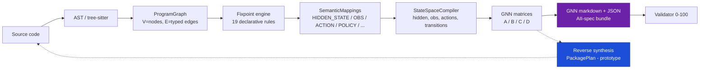

# COGANT — Codebase-to-GNN Translation Engine

> **Translate software repositories into Active Inference generative models.**

COGANT converts Python, JavaScript, and TypeScript codebases into
[Active Inference Institute](https://activeinference.org/) **Generalized Notation Notation (GNN)**
state-space models — complete with A/B/C/D probabilistic matrices, Markov blanket
partitions, and principled free-energy derivations.

Current release: **v0.1.0 Alpha** (2026-04-09). 642+ tests passing.

---

## What it does

```text
repo/ ──[ingest]──► ProgramGraph ──[translate]──► SemanticMappings ──[statespace]──► GNN
  V=nodes            19 declarative rules             HIDDEN_STATE,                A/B/C/D
  E=typed edges      fixpoint to convergence          OBSERVATION,                 matrices
                                                      ACTION, POLICY, ...
```

- **Forward path**: source code → program dependence graph → fixpoint translation → semantic
  mappings → compiled state space → GNN markdown bundle (AII-spec compliant).
- **Reverse path** *(prototype)*: `py/cogant/reverse/` ships the scaffolding for synthesizing a
  runnable Python package from a GNN bundle. CLI surface for this is tracked as P2 in
  [`_rnd/R&D_LOG.md`](_rnd/R&D_LOG.md).

## Quick start

```bash
uv sync --extra all
uv run cogant translate examples/control_positive/calculator \
    --output output/calculator \
    --layout-output
uv run cogant validate output/calculator/gnn_package
```

Expected: a populated `output/calculator/` tree with `bundle.json`, `gnn_package/model.gnn.md`,
and a validator report scoring **100.0 / 100** on the calculator fixture.

## Features (v0.1.0)

- Python parser via CPython `ast`; JavaScript / TypeScript via `tree-sitter` front ends.
- **19 translation rules** across five families (structural, semantic, control, behavioral,
  resilience) — see `py/cogant/translate/rules/`.
- GNN A/B/C/D matrices derived from READS / WRITES / CONSTRAINT / CONFIGURATION edges; AII
  validator at **100 / 100** on control-positive fixtures (`calculator`, `event_pipeline`,
  `flask_mini`).
- Principled variational free energy / expected free energy math — not keyword heuristics.
- Markov blanket partition: `O(V + E)`, five seed strategies (`auto`, `module`, `class`,
  `subgraph`, `manual`).
- Git-diff incremental mode (`cogant changed`).
- Rust acceleration backend (optional, feature-gated: `COGANT_USE_RUST=1`).
- Reverse synthesis scaffolding: GNN bundle → Python package plan.
- **900+ tests across unit, integration, property, and golden suites**; coverage ~77%.
- `cogant doctor` — environment diagnostics (Python, `uv`, tree-sitter grammars, Rust
  backend, disk space).

## CLI surface

`cogant --help` is ground truth. The Typer app in
[`py/cogant/cli/main.py`](py/cogant/cli/main.py) currently registers **16** subcommands:

| Command | Purpose |
| --- | --- |
| `init` | Scaffold a new `cogant.yaml` project config. |
| `doctor` | Environment diagnostics. |
| `scan` | Discover and classify source files. |
| `extract-static` | Run static parsers; produce symbol facts. |
| `extract-dynamic` | Consume runtime traces (coverage, logs) if present. |
| `graph` | Build the program graph from extracted facts. |
| `translate` | Full pipeline: ingest → graph → translate → statespace → export. |
| `statespace` | Run the state-space compiler only. |
| `process` | Run post-translation processing passes. |
| `export-gnn` | Write a GNN package from an existing bundle. |
| `render` | Render an interactive HTML / Markdown site. |
| `viz` | Emit graph and blanket visualizations. |
| `validate` | Validate a bundle, run directory, or GNN package. |
| `diff` | Compare two runs (drift metrics). |
| `changed` | Git-diff incremental mode. |
| `benchmark` | Run the micro-benchmark suite. |

## Architecture



See [docs/architecture/](docs/architecture/) for per-module deep dives.

## Documentation

- **Getting started**
  - [Installation](docs/getting-started/installation.md)
  - [Quickstart](docs/getting-started/quickstart.md)
- **Tutorials (numbered, in order)**
  - [1. Quickstart — 5 minute end-to-end](docs/tutorials/01_quickstart.md)
  - [2. Small repo walkthrough — `calculator`](docs/tutorials/02_small_repo_walkthrough.md)
  - [3. Flask app walkthrough](docs/tutorials/03_flask_walkthrough.md)
  - [4. Writing a custom translation rule](docs/tutorials/04_custom_rules.md)
  - [5. Reading A / B / C / D matrices](docs/tutorials/05_gnn_interpretation.md)
  - [6. Reverse mode — GNN → code](docs/tutorials/06_reverse_mode.md)
  - [7. Authoring a language plugin](docs/tutorials/07_plugin_authoring.md)
- **Theory**
  - [Code as a generative model](docs/theory/code_as_generative_model.md)
  - [Active Inference primer](docs/theory/active_inference_primer.md)
  - [Active Inference mapping (deep)](docs/theory/active_inference.md)
  - [GNN format reference](docs/theory/gnn_format_reference.md)
- **Reference**
  - [CLI reference](docs/cli.md)
  - [Glossary](docs/reference/glossary.md)
  - [API reference](docs/api/)
- [R&D log](_rnd/R&D_LOG.md)

## Development

```bash
uv sync --extra all            # install everything (python + viz + tree-sitter + rust bindings)
uv run cogant doctor            # verify the environment
uv run pytest tests/ -q         # 900+ tests; expect ~77% coverage
uv run mypy py/cogant/          # type check
uv run ruff check py/           # lint
make build-rust                 # optional: compile the rust backend
```

Contributing guide: [CONTRIBUTING.md](CONTRIBUTING.md). Code of conduct:
[CODE_OF_CONDUCT.md](CODE_OF_CONDUCT.md).

## Honest scope

COGANT prioritizes **transparent, reproducible graphs** over **complete semantics**. Whole-program
soundness is not the goal; provenance, deterministic output, and explicit uncertainty are. When
the pipeline lacks evidence for a rule or matrix entry, it emits a **validation finding** and a
documented fallback rather than silently guessing. Known limitations — identity-biased A matrix
fill, identity-fallback B tensor, uniform C/D when no constraint/configuration evidence exists —
are tracked in [`docs/theory/active_inference.md § Known limitations`](docs/theory/active_inference.md#known-limitations).

## License

MIT — see [`LICENSE`](LICENSE).

## Citation

```bibtex
@software{cogant2026,
  title  = {COGANT: Codebase-to-GNN Translation Engine},
  author = {{COGANT contributors}},
  year   = {2026},
  url    = {https://github.com/cogant/cogant},
  version = {0.1.0}
}
```
