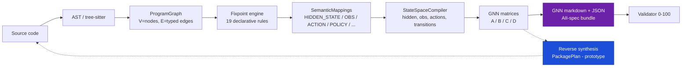

# COGANT — Codebase-to-GNN Translation Engine

> **Translate software repositories into Active Inference generative models.**

COGANT converts Python, JavaScript, and TypeScript codebases into
[Active Inference Institute](https://activeinference.org/) **Generalized Notation Notation (GNN)**
state-space models — complete with A/B/C/D probabilistic matrices, Markov blanket
partitions, and principled free-energy derivations.

Current release: **v0.5.0** (2026-04-10). 2129 tests passing, 86 skipped, 12 failing, 2 xfailed, 1 xpassed; line coverage 83.42% on `py/cogant/`. mypy strict: 0 errors.

---

## What it does

```text
repo/ ──[ingest]──► ProgramGraph ──[translate]──► SemanticMappings ──[statespace]──► GNN
  V=nodes            19 declarative rules             HIDDEN_STATE,                A/B/C/D
  E=typed edges      fixpoint to convergence          OBSERVATION,                 matrices
                                                      ACTION, POLICY, ...
```

- **Forward path**: source code → program dependence graph → fixpoint translation → semantic
  mappings → compiled state space → GNN markdown bundle (AII-spec compliant).
- **Reverse path**: `py/cogant/reverse/` synthesizes a runnable Python package from any GNN
  bundle and is exposed through the top-level `cogant reverse` and `cogant roundtrip` CLI
  subcommands. The v0.5.0 POLICY / CONTEXT stub-emission fix attains **23 / 23 ISOMORPHIC**
  ($\varepsilon \geq 0.8$) on the canonical roundtrip evaluation set — see
  [`docs/evaluation/ROUNDTRIP_IMPROVEMENT.md`](docs/evaluation/ROUNDTRIP_IMPROVEMENT.md) and
  [`docs/evaluation/ROUNDTRIP_EVAL.md`](docs/evaluation/ROUNDTRIP_EVAL.md).
- **Incremental mode**: `cogant analyze --incremental <git-ref>` (or
  `PipelineConfig.incremental_since`) re-uses the previous run's program graph for unchanged
  source paths, measuring **19.6× no-change** and **5.6× single-file** speedups on the Flask
  benchmark.
- **Production server**: `cogant.server.app` exposes `/health` and `/translate` endpoints; a
  packaged `Dockerfile` (python:3.12-slim + uv, `EXPOSE 8080`) and `docker-compose.yml` turn
  the pipeline into a deployable microservice.

## Quick start

```bash
uv sync --extra all
uv run cogant translate examples/control_positive/calculator \
    --output output/calculator \
    --layout-output
uv run cogant validate output/calculator/gnn_package
```

Expected: a populated `output/calculator/` tree with `bundle.json`, `gnn_package/model.gnn.md`,
and a validator report scoring **100.0 / 100** on the calculator fixture.

## Features (v0.5.0)

- Python parser via CPython `ast`; JavaScript / TypeScript via `tree-sitter` front ends
  (JS-grammar fallback for `.ts` files on mixed repositories).
- **19 translation rules** across five families (structural, semantic, control, behavioral,
  resilience) — see `py/cogant/translate/rules/`.
- GNN A/B/C/D matrices derived from READS / WRITES / CONSTRAINT / CONFIGURATION edges; AII
  validator at **100 / 100** on all six shipped fixtures (`calculator`, `event_pipeline`,
  `flask_mini`, `flask_app`, `requests_lib`, `json_stdlib`).
- Principled variational free energy / expected free energy math — not keyword heuristics.
- Markov blanket partition: `O(V + E)`, five seed strategies (`auto`, `module`, `class`,
  `subgraph`, `manual`).
- **Incremental analysis mode**: `cogant analyze --incremental <git-ref>` /
  `PipelineConfig.incremental_since` — 19.6× no-change, 5.6× single-file speedups on the
  Flask benchmark. Complements the file-level `cogant changed` git-diff helper.
- **Multi-episode Bayesian learning**: `AgentRuntime.run_multi_episode`, `run_episode`,
  `update_D_from_posterior`, `update_A_from_counts`.
- **Production FastAPI server**: `cogant.server.app` with `/health` and `/translate`
  endpoints, integration test suite, and Docker / docker-compose packaging.
- **Forward-reverse-forward round-trip**: 23 / 23 ISOMORPHIC across 13 zoo fixtures,
  3 real-world-example fixtures, and 8 uncurated third-party libraries; see
  [`docs/evaluation/ROUNDTRIP_EVAL.md`](docs/evaluation/ROUNDTRIP_EVAL.md) and
  [`docs/evaluation/ROUNDTRIP_IMPROVEMENT.md`](docs/evaluation/ROUNDTRIP_IMPROVEMENT.md).
- **Cross-language roundtrip**: `examples/zoo/13_js_observer` demonstrates a JavaScript
  observer round-trip with `role_match_score = 1.0`.
- **Rust acceleration** (optional, feature-gated: `COGANT_USE_RUST=1`): PyO3
  `connected_components` FFI for graph construction; pure-Python fallback elsewhere.
- Reverse synthesis: `cogant reverse` and `cogant roundtrip` subcommands synthesize a
  runnable Python package from any GNN bundle and verify forward-reverse-forward
  isomorphism.
- **2230 tests** across unit, integration, property, golden, and fuzz suites (2129 passing, 86 skipped for optional toolchains); line coverage **83.42%** on `py/cogant/`. Type stubs (`.pyi`) and `py.typed` marker ship with the package.
- `cogant doctor` — environment diagnostics extended in v0.5.0 with tree-sitter grammar
  checks, uv lockfile parity, and optional-dependency audit.

## CLI surface

`cogant --help` is ground truth. The Typer app in
[`py/cogant/cli/main.py`](py/cogant/cli/main.py) currently registers **22** subcommands:

| Command | Purpose |
| --- | --- |
| `init` | Initialize a new COGANT project (guided first-time setup). |
| `doctor` | Diagnose the COGANT runtime environment (Python, uv, tree-sitter, Rust, disk). |
| `scan` | Scan a repository and print a quick summary. |
| `extract-static` | Run static analysis only (AST, type inference, symbol tables). |
| `extract-dynamic` | Run dynamic analysis (coverage databases, runtime traces). |
| `graph` | Build and summarise the program dependency graph. |
| `translate` | Full pipeline: ingest → graph → translate → statespace → export. |
| `statespace` | Compile an Active Inference state-space model (S, O, A, π). |
| `process` | Extract the pipeline / execution process model from a repository. |
| `export-gnn` | Re-export a previously generated GNN bundle in a different format. |
| `render` | Render an interactive HTML site from a bundle. |
| `viz` | Generate PNGs for every Mermaid / SVG / dot / network artifact in a run. |
| `validate` | Run validation checks on a bundle, run directory, or GNN package. |
| `diff` | Compare two bundles or output directories and report drift. |
| `changed` | List files changed since a git ref (incremental analysis helper). |
| `explain` | Explain why a node was assigned its Active Inference role. |
| `benchmark` | Benchmark pipeline wall-clock performance over several runs. |
| `reverse` | Synthesize a Python package from a GNN markdown file. |
| `roundtrip` | Verify forward-reverse-forward round-trip isomorphism. |
| `plugin` | Manage and inspect COGANT plugins. |
| `migrate` | Migrate GNN files to the current schema version. |

The `translate` subcommand accepts `--incremental <git-ref>` (equivalent to
`PipelineConfig.incremental_since`) for per-commit CI re-runs over a Git diff.

## Architecture



See [docs/architecture/](docs/architecture/) for per-module deep dives.

## Documentation

- **Getting started**
  - [Installation](docs/getting-started/installation.md)
  - [Quickstart](docs/getting-started/quickstart.md)
- **Tutorials (numbered, in order)**
  - [1. Quickstart — 5 minute end-to-end](docs/tutorials/01_quickstart.md)
  - [2. Small repo walkthrough — `calculator`](docs/tutorials/02_small_repo_walkthrough.md)
  - [3. Flask app walkthrough](docs/tutorials/03_flask_walkthrough.md)
  - [4. Writing a custom translation rule](docs/tutorials/04_custom_rules.md)
  - [5. Reading A / B / C / D matrices](docs/tutorials/05_gnn_interpretation.md)
  - [6. Reverse mode — GNN → code](docs/tutorials/06_reverse_mode.md)
  - [7. Authoring a language plugin](docs/tutorials/07_plugin_authoring.md)
- **Theory**
  - [Code as a generative model](docs/theory/code_as_generative_model.md)
  - [Active Inference primer](docs/theory/active_inference_primer.md)
  - [Active Inference mapping (deep)](docs/theory/active_inference.md)
  - [GNN format reference](docs/theory/gnn_format_reference.md)
- **Reference**
  - [CLI reference](docs/cli.md)
  - [Glossary](docs/reference/glossary.md)
  - [API reference](docs/api/)
- [R&D log](docs/evaluation/R&D_LOG.md)

## Development

```bash
uv sync --extra all            # install everything (python + viz + tree-sitter + rust bindings)
uv run cogant doctor            # verify the environment
uv run pytest tests/ -q         # 2129 passing tests; expect ~83.42% line coverage
uv run mypy py/cogant/          # type check (strict; 0 errors on 179 source files)
uv run ruff check py/cogant/    # lint (0 errors on v0.5.0)
make build-rust                 # optional: compile the rust backend
```

Contributing guide: [CONTRIBUTING.md](CONTRIBUTING.md). Code of conduct:
[CODE_OF_CONDUCT.md](CODE_OF_CONDUCT.md).

## Honest scope

COGANT prioritizes **transparent, reproducible graphs** over **complete semantics**. Whole-program
soundness is not the goal; provenance, deterministic output, and explicit uncertainty are. When
the pipeline lacks evidence for a rule or matrix entry, it emits a **validation finding** and a
documented fallback rather than silently guessing. Known limitations — identity-biased A matrix
fill, identity-fallback B tensor, uniform C/D when no constraint/configuration evidence exists —
are tracked in [`docs/theory/active_inference.md § Known limitations`](docs/theory/active_inference.md#known-limitations).

## License

MIT — see [`LICENSE`](LICENSE).

## Citation

```bibtex
@software{cogant2026,
  title  = {COGANT: Codebase-to-GNN Translation Engine},
  author = {{COGANT contributors}},
  year   = {2026},
  url    = {https://github.com/cogant/cogant},
  version = {0.5.0}
}
```
