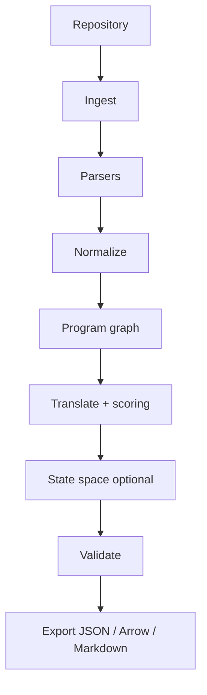

# COGANT: Codebase-to-GNN Translation Engine

COGANT turns repositories into **program graphs** you can train on: static structure, typed symbols, and controlled semantics, exported in formats downstream tools already consume (JSON, columnar tables, narrative Markdown). The aim is not to replace your compiler or IDE, but to give models and analyzers a **stable intermediate representation** that is explicit about what was inferred, what was observed, and how confident the pipeline is.

**Intended uses:** program understanding at scale, architecture mining, retrieval-augmented code generation, and research prototypes that need reproducible graph datasets from real code.

---

## What you get

| Layer | Responsibility |
| --- | --- |
| **Ingest** | Discover files, respect size and ignore rules, attach filesystem provenance. |
| **Parse** | Language-specific ASTs (initial focus: Python and Rust). |
| **Normalize** | Cross-language naming, qualification, and reference linking. |
| **Graph** | A property graph: symbols, types, calls, imports, dataflow hints where available. |
| **Translate & score** | Rule-driven transforms toward GNN-friendly tensors or tables; calibrated confidence (not magic). |
| **State space** | Optional control-flow and state-machine views for analyzable subsystems. |
| **Validate & export** | Schema checks, reports, and lossless-ish exports with provenance. |

**Outputs** are meant to be **machine-checkable**: every nontrivial edge or attribute should be traceable to a source span or a documented inference rule.

---

## Features

- **Codebase ingestion**: Bounded scans with excludes and size limits; deterministic ordering where possible.
- **Symbol extraction**: Classes, functions, variables, modules, and cross-file edges when resolution is enabled.
- **Program graph construction**: Property graph with typed nodes and edges (calls, defines, uses, imports, type relations).
- **Translation rules**: Declarative transforms from program graphs to tensor/table-friendly layouts.
- **Confidence scoring**: Per-edge or per-node scores with explicit semantics (parser certainty vs. heuristic inference).
- **State space compilation**: Structured views of control flow for pipelines that expose explicit state machines.
- **Export**: Markdown (human audit), JSON (interop), PyArrow (columnar training pipelines).
- **Validation & provenance**: Structural validation, issue reports, and source attribution.
- **CLI & Python API**: Thin CLI over the same core types the library exposes.

---

## Concepts

### Program graph

The **program graph** is the canonical artifact: nodes for symbols and auxiliary entities (files, scopes), edges for semantic relationships. Downstream GNN code typically materializes:

- **Node features** from static attributes (arity, visibility, rough role).
- **Edge indices** from selected relation types (e.g. `CALLS`, `IMPORTS`, `TYPE_USES`).
- **Optional labels** for supervised tasks, supplied outside COGANT or via rules.

### GNN-compatible export

“GNN-compatible” here means: **regular tables or tensors** plus **metadata** describing node/edge types and provenance—not a commitment to a single framework. PyArrow and JSON are first-class so you can feed PyTorch Geometric, DGL, JAX, or custom trainers without a lock-in layer.

### Confidence

Scores are **epistemic about the pipeline**, not about whether your app is “good code.” Low confidence usually means incomplete type information, unresolved imports, or heuristic linking—surfaced so training data can be filtered or weighted.

---

## Installation

Python sources live under `py/` (see `package-dir` in `pyproject.toml`). Install from the **repository root**.

### From source (development)

```bash
git clone https://github.com/cogant/cogant.git
cd cogant
uv sync --all-extras
# or: uv pip install -e ".[dev,viz]"
```

Using `pip` only:

```bash
pip install -e ".[dev,viz]"
```

Optional legacy pin file: `py/requirements.txt` (prefer `pyproject.toml` and `uv`).

### Published package (when released)

```bash
pip install cogant
```

---

## Quick start

The API below is the **target surface**; as modules land, imports and method names should converge here. If something drifts during early development, prefer the CLI `--help` and inline package docstrings for ground truth.

### Python API

```python
from pathlib import Path

from cogant import PipelineRunner, Session
from cogant.api.pipeline import PipelineConfig

# Option A — ergonomic path-based session
session = Session(
    workspace="/tmp/cogant-workspace",
    repo_path=Path("path/to/repo"),
)
session.build_graph()
session.export_all("output/session", layout=True)

# Option B — full pipeline runner (same underlying orchestration)
runner = PipelineRunner()
config = PipelineConfig(output_dir="output/pipeline", layout_output=True)
bundle = runner.run(str(Path("path/to/repo").resolve()), config)

summary = bundle.repo_summary()
graph = bundle.program_graph()  # method: stage result "graph"
validation = bundle.validation_report()
print(summary, graph.get("statistics", {}), validation)
bundle.save_json("output/bundle.json")
```

### Command line

Authoritative reference: [docs/CLI_GUIDE.md](docs/CLI_GUIDE.md). The Typer app in [`py/cogant/cli/main.py`](py/cogant/cli/main.py) registers **14** subcommands; `cogant --help` is ground truth if this count drifts.

```bash
cogant scan /path/to/repo
cogant translate /path/to/repo --output output/ --layout-output
cogant validate output/bundle.json
cogant render output/bundle.json --output html_site/
cogant viz output/
cogant benchmark /path/to/repo --iterations 1
```

---

## Architecture

ASCII overview:

```text
Input Codebase
    |
    v
[Ingest]
  - File discovery
  - Language detection
  - Size / ignore policy
    |
    v
[Parser]
  - AST extraction (Python / Rust)
  - Symbol tables
  - Partial type and import information
    |
    v
[Normalize]
  - Cross-language symbol identity
  - Qualified names
  - Best-effort reference resolution
    |
    v
[Graph]
  - Nodes: symbols, files, scopes
  - Edges: defines, uses, calls, imports, type relations
  - Attributes: source spans, flags
    |
    v
[Translate + score]
  - Rule packs
  - Confidence and diagnostics
  - Optional state-space compilation
    |
    v
[Validate + export]
  - Schema validation
  - Provenance records
  - Markdown / JSON / PyArrow
```

Mermaid view (same pipeline):



---

## Modules

### Core

| Module | Role |
| --- | --- |
| `cogant.ingest` | Discovery, policies, staging inputs |
| `cogant.parsers` | Language front ends |
| `cogant.schemas` | Shared types and validation |
| `cogant.graph` | In-memory graph model and queries |
| `cogant.normalize` | Cross-language alignment |
| `cogant.process` | Pipeline orchestration |
| `cogant.translate` | Rule application |
| `cogant.scoring` | Confidence and diagnostics |
| `cogant.validate` | Graph and export checks |
| `cogant.statespace` | Control-flow and state-oriented views |
| `cogant.export` | Writers for Markdown, JSON, PyArrow |
| `cogant.config` | Config loading and overrides |
| `cogant.cli` | User-facing commands |
| `cogant.api` | Stable Python entry points |

### Supporting

| Module | Role |
| --- | --- |
| `cogant.dynamic` | Hooks for execution-informed facts (future / optional) |
| `cogant.static` | Shared static helpers |
| `cogant.plugins` | Extension points |
| `cogant.provenance` | Source attribution and run metadata |
| `cogant.viz` | Graph and report visualization |

---

## Configuration

Place `cogant.yaml` at the repository root (or pass `--config` once the CLI supports it).

```yaml
# cogant.yaml
version: 1

ingest:
  source_dirs:
    - src
    - lib
  exclude_patterns:
    - "*.pyc"
    - "__pycache__"
    - ".git"
  max_file_size_mb: 50

parser:
  languages: ["python", "rust"]
  follow_imports: true
  resolve_external: false

translation:
  rules_file: "./rules/default.yaml"
  confidence_threshold: 0.7
  include_internal_calls: true

export:
  format: "json"
  include_provenance: true
  compression: "gzip"
```

A fully commented reference `cogant.yaml` should ship beside this README as the options widen.

---

## Testing

```bash
make test
uv run pytest tests/unit -v
uv run pytest tests/integration -v
uv run pytest --cov=cogant --cov-report=html
```

Golden tests (where present) protect export stability; integration tests run on small fixture repositories.

---

## Development

### Setup

```bash
make install
make dev
```

### Common tasks

```bash
make test
make lint
make format
make type-check
make build-rust
make clean
```

### Target layout

```text
cogant/
├── py/
│   └── cogant/
│       ├── api/
│       ├── cli/
│       ├── config/
│       ├── export/
│       ├── graph/
│       ├── ingest/
│       ├── normalize/
│       ├── parsers/
│       ├── process/
│       ├── schemas/
│       ├── scoring/
│       ├── statespace/
│       ├── translate/
│       ├── validate/
│       └── ...
├── rust/
│   ├── cogant-core/
│   └── bindings/
├── parsers/
├── specs/
├── examples/
│   ├── python-service/
│   └── workflow-engine/
├── tests/
│   ├── unit/
│   ├── integration/
│   └── golden/
├── docs/
└── benchmarks/
```

---

## Examples

```bash
uv run cogant translate examples/python-service --output output/python-service --layout-output
uv run cogant translate examples/workflow-engine --output output/workflow-engine --layout-output
```

---

## Roadmap

- [ ] **v0.2.0**: JavaScript, Go, Java parsers (behind feature flags)
- [ ] **v0.3.0**: Optional dynamic analysis hooks with strict sandboxing
- [ ] **v0.4.0**: Interactive exploration UI for graphs and provenance
- [ ] **v0.5.0**: Curated plugin channel
- [ ] **v1.0.0**: Stable graph schema and Python API

---

## Contributing

Contributions are welcome. See [`docs/AGENTS.md` § Contributing](docs/AGENTS.md) for process and licensing acknowledgments.

**High-impact areas:** parser fidelity, rule packs for new languages, validation diagnostics, performance on large repos, and documentation of edge cases.

---

## License

MIT License — see the `LICENSE` file.

---

## Citation

```bibtex
@software{cogant2024,
  title={COGANT: Codebase-to-GNN Translation Engine},
  author={{COGANT contributors}},
  year={2024},
  url={https://github.com/cogant/cogant}
}
```

---

## Support

- Documentation hub: [docs/README.md](docs/README.md) (includes the former documentation map and onboarding)
- Site (if published): https://cogant.dev/docs  
- Issues: https://github.com/cogant/cogant/issues  
- Discussions: https://github.com/cogant/cogant/discussions  

---

## Related work

- Neural program synthesis and code generation
- Static analysis and scalable program graphs
- Graph neural networks for software engineering tasks
- AST and graph-based code models

---

## Honest scope

COGANT prioritizes **transparent graphs** over **complete semantics**. Whole-program soundness is not the goal; reproducibility, provenance, and explicit uncertainty are. When in doubt, the pipeline should emit a **validation finding** rather than silently guessing.

What is implemented versus aspirational (languages, exporters, depth of analysis) is summarized in [docs/SPEC.md § Implementation status](docs/SPEC.md#implementation-status).
