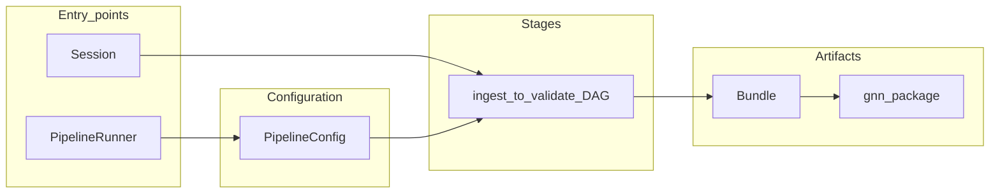

# API and Workflows {#sec:03-api-and-workflows}

This section describes the programmatic surface that the shipped Python package exposes in practice, aligned with `../cogant/docs/api/README.md` and the inventory-style notes under `../cogant/docs/reference/`. It is **not** an empirical benchmark section; COGANT does not ship comparative timing claims in the manuscript layer. Instead, it records the **surface area** users can rely on: two complementary entry points (a Session for stepwise work and a Pipeline for batch runs), the Bundle accessors that expose their artifacts, a command-line interface, and a Review API for human-in-the-loop curation.

**Scope snapshot.** For what is implemented, staged, or omitted in v{{VERSION}} (Rust paths, optional parsers, CLI flags), treat [`../cogant/docs/reference/implementation_status.md`](../cogant/docs/reference/implementation_status.md) as the live boundary; if this section lags a release, follow the package table first.

## End-to-end data flow

`Session` exposes stepwise methods (`extract_static`, `build_graph`, …) up to `export_all`; `PipelineRunner` executes the full ingest-to-validate DAG — including the `validate` gate that the stepwise `Session` path does not run — under one `PipelineConfig`. Exported files (`model.gnn.md`, JSON companions, `manifest.json`) materialize under the configured output tree. Authoritative command and flag list: [`../cogant/docs/cli/README.md`](../cogant/docs/cli/README.md).

## Session-oriented workflow

Use `Session` for interactive exploration, notebook-driven debugging, and incremental re-runs where you want to materialize each stage's output as a Python attribute. It is the right choice when a user wants to inspect intermediate artifacts between stages, iterate on a single repository in a notebook, or debug a specific extraction step without committing to a full scripted run. Each call returns control to the caller so that the graph, mappings, or state-space model can be examined before the next stage is invoked.

`Session.from_target` accepts a local path or URL, then supports a stepwise workflow:

- `extract_static` — AST-oriented extraction for supported languages.
- `extract_dynamic` — traces and coverage when inputs exist.
- `build_graph` — program graph construction.
- `translate_to_gnn` — Generalized Notation Notation (GNN) representation.
- `compile_state_space` — behavioral model when the pipeline has sufficient data.
- `export_all` — writes JSON artifacts under a chosen output directory.

This path suits interactive notebooks and incremental debugging.

## Pipeline-oriented workflow

Use `PipelineRunner` for scripted, reproducible batch runs where all stages are configured up front and the end-state is a single `Bundle`. It is the right choice when a user wants to process many repositories with a fixed configuration, wire COGANT into CI, or make ordered stage execution and plugin settings explicit enough to review. Because the whole run is described by a single `PipelineConfig`, it can be checked into version control and replayed without manual intervention on the same inputs and environment.

`PipelineRunner` with `PipelineConfig` runs an ordered list of {{STAGE_COUNT}} stages (`ingest`, `static`, `normalize`, `graph`, `dynamic`, `translate`, `statespace`, `process`, `export`, `validate`). The `dynamic` stage is optional (`PipelineConfig.skip_dynamic` or `--no-dynamic` CLI flag) and merges coverage/traces to enrich confidence and mappings. Configuration can skip stages, attach plugin settings per language, set `output_dir`, verbosity, and dry-run mode. Results aggregate into a **Bundle** with `stage_results`, error lists, and accessors described below.

## Bundle accessors

The bundle API exposes stage summaries and convenience render/export helpers, including:

- `repo_summary`, `program_graph`, `state_space_model`, `process_model`
- `gnn_markdown` — compact markdown summary built from `stage_results["translate"]`
- `validation_report`
- `render_site` — static HTML site with graph and model views
- `to_json` / `save_json`

For canonical 19-section Generalized Notation Notation artifacts (`model.gnn.md` plus companion JSON), use the export outputs documented in `../cogant/docs/export/README.md`; `Bundle.gnn_markdown()` is intentionally a lightweight report surface.

## Command-line interface

The CLI entry point (`cogant.cli.main`) registers **26** top-level subcommands (`cogant --help`). The high-traffic paths are `cogant translate` (full pipeline, equivalent to `cogant analyze`; accepts `--incremental <git-ref>` for per-commit CI re-runs over a Git diff), `cogant validate`, `cogant reverse`, `cogant roundtrip`, and `cogant doctor` (environment diagnostics). Other commands cover scanning (`scan`, `extract-static`, `extract-dynamic`, `graph`), compilation (`statespace`, `process`), re-export (`export-gnn`, `export`), static/graph analytics (`analyze-static`, `analyze-graph`), visualization (`render`, `viz`, `visualize`, `diff`), review (`explain`), upstream interop (`upstream-gnn` — drives the upstream `generalized-notation-notation` 25-step pipeline against an existing `gnn_package/`, also exposed as `--upstream-gnn-pipeline` on `translate` / `analyze` / `validate`), and lifecycle management (`init`, `plugin`, `migrate`, `benchmark`, `changed`). Exact flags live in `../cogant/docs/cli/README.md` and the single-page [`../cogant/docs/cli_reference.md`](../cogant/docs/cli_reference.md); the manuscript does not duplicate them to avoid drift.

**Per-command stage coverage (RedTeam F40 disambiguation).** Not every
subcommand exercises all {{STAGE_COUNT}} runner stages. `cogant translate` and
`cogant analyze` (default form) run the full sequence enforced by
`cogant.pipeline.RUNNER_STAGES` (and pinned by
`tools/audit_stage_list.py`). `cogant explain` runs the
*minimal-pipeline* path
`ingest → static → normalize → graph → translate` (no `dynamic`,
`statespace`, `process`, `export`, `validate`); this is documented in
its CLI docstring (`py/cogant/cli/explain.py`). `cogant statespace`
runs `static → graph → translate → statespace` and prints a count.
`cogant validate` runs `ingest → static → normalize → graph → validate`
and skips the in-between translate/statespace/process stages. A
reviewer running a non-default subcommand and observing fewer than {{STAGE_COUNT}}
recorded stages should consult the subcommand's docstring or
`cli_reference.md`; the {{STAGE_COUNT}}-stage claim refers specifically to
`cogant translate` (the default `cogant analyze` form), not to every
subcommand.

## Review API

`ReviewAPI` supports interactive curation: load a bundle, present mappings, accept, reject, or edit, then save a curated bundle. This closes the loop when human review is part of the ML dataset construction.
